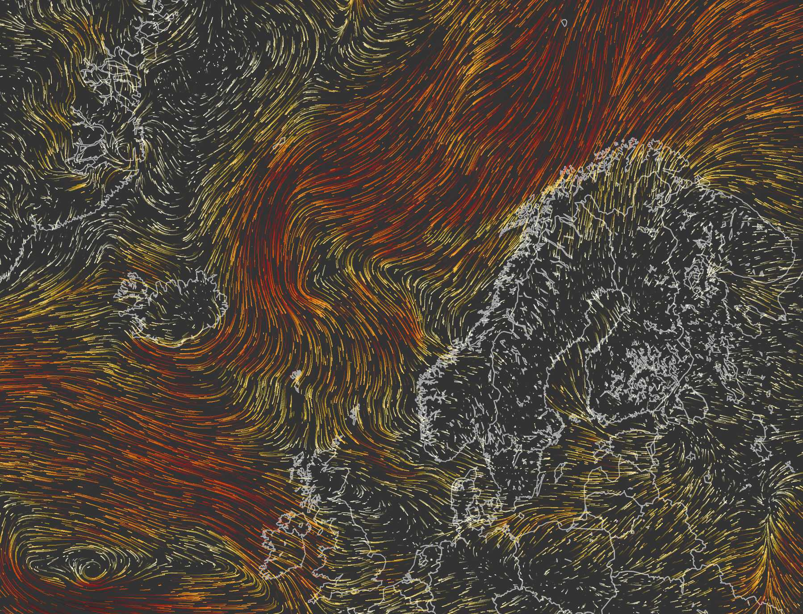
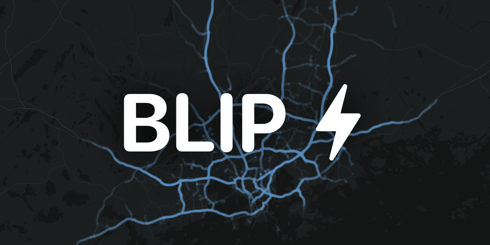
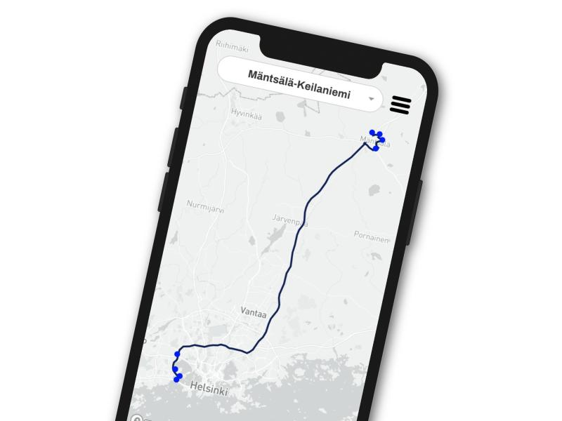

## Hi there 👋

I'm Santeri, experienced Full Stack developer focusing on map related things and other geoinformatics.

---

### Some of my somewhat recent favourite projects
<table>
  <tr>
    <td width="25%" valign="top">
      
      Matalapaine //
      <a href="https://github.com/Napuu/weather-dashboard-front">
        source + docs
      </a>
      // 
      <a href="https://matalapaine.fi">
        live
      </a>
    </td>
    <td width="25%" valign="top">
      
      BLIP //
      <a href="https://github.com/Napuu/weather-dashboard-front">
        source + docs
      </a>
      // 
      <a href="https://matalapaine.fi">
        live
      </a>
    </td>
    <td width="25%" valign="top">
       
        My first Blender project!
    </td>
    <td width="25%" valign="top">
      
      Kiesi.app //
      <a href="https://github.com/JaanTaponen/kiesi.app">
        source + docs
      </a>
    </td>
  </tr>
</table>
